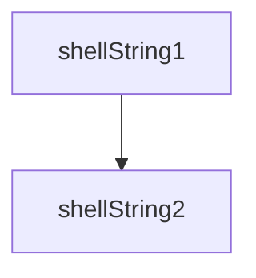
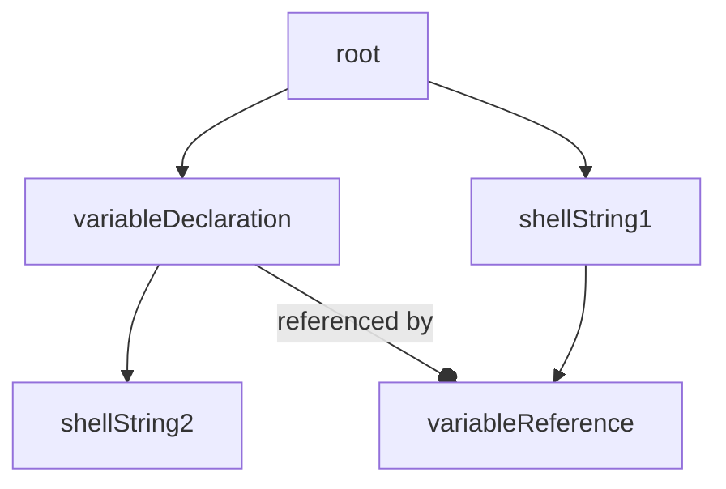

# The unnesting subshells workaround

Bash loses the error code of a subshell (e.g. `exit 1` is ignored).  The workaround is to move the subshell out
and save the result in a variable.

The end result will be something like:
```bash
declare __bp_var1
__bp_var1=$(unnestedSubShellCommand)
$(outerSubshellUses $___bp_var1)
```

We do this by transforming the BAST tree before we `render`


becomes
